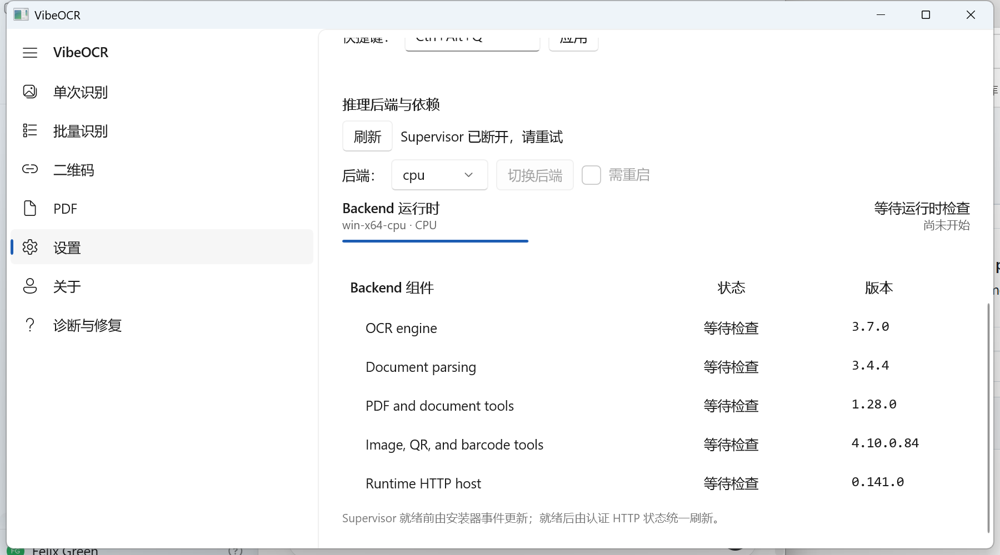
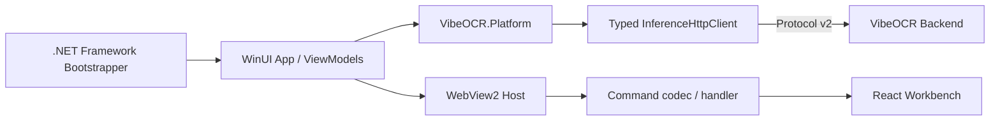

<div align="center">

# VibeOCR Next

**基于 .NET 10、WinUI 3 与 React 的现代 Windows OCR 桌面客户端**

[](https://github.com/FelixJI/vibeocr-next/actions/workflows/ci.yml)
[](https://github.com/FelixJI/vibeocr-next/releases/latest)
[](global.json)
[](src/dotnet/VibeOCR.App/WebAssets/package.json)
[](.ci/project.json)
[](LICENSE)

[下载](#下载与使用) · [架构](#架构) · [开发](#开发与验证) · [源码导读](docs/source-reading-guide.md) · [Workbench](docs/web-workbench-architecture.md)

</div>

VibeOCR Next 是 VibeOCR 的 WinUI 3 桌面客户端。它使用 .NET Platform 层管理窗口、运行时与 typed
Protocol client，并通过 WebView2 承载 React/TypeScript 高级 workbench。OCR/PDF 推理由独立 Backend
Release 在本机完成。



> [!IMPORTANT]
> Next 仅支持 Windows 10/11 x64，桌面技术栈是 WinUI 3，不是 WPF。Release 会绑定经过验证的
> Backend 与 Protocol 组件。

## 主要能力

- 原生 WinUI 3 桌面识别工作流；
- 本地 Backend 解析、安装、启动、ready 与 capability 协商；
- typed Protocol client 驱动的 job 提交、观察和控制；
- React/TypeScript WebAssets 与 WebView2 高级 workbench；
- 单实例、运行时前置检查和 Windows 打包交付。

## 下载与使用

1. 从 [Releases](https://github.com/FelixJI/vibeocr-next/releases/latest) 下载
   `VibeOCRNext-v<version>-win-x64.zip`。
2. （可选）校验完整性：同一次 Release 附带 `SHA256SUMS` 权威摘要。计算本地哈希并与其中
   对应文件条目的摘要比对（大小写不敏感）：

   ```powershell
   Get-FileHash .\VibeOCRNext-v*-win-x64.zip -Algorithm SHA256
   ```

3. 解压整个目录后运行根目录的 `VibeOCR.exe`；不要只复制 `current` 子目录。
4. 应用数据固定保存在解压根的 `state`；应用更新由 Velopack 在应用内检查、下载并应用。

### 运行环境与组件安装

- 应用随包提供快速 OCR 等基础能力，首次启动时会自动准备基础运行环境；高级组件按需安装。
- 在“设置 → 运行环境”中选择“推理设备”（CPU 或 CUDA GPU），并按需分别勾选
  “paddleocr”“mineru”或“CUDA GPU 运行时”等组件。这些选择只是安装意图：点击“预览安装
  范围”后，Backend 会给出安装计划，包括推理设备、各组件的保留/安装/替换/移除、预计下载量、
  新增磁盘占用和阻碍项；核对后点“确认此计划并安装”才会暂停识别服务并执行。
- 推理设备只是运行环境的安装目标：选择 CUDA GPU 不代表识别引擎已安装或可用，随包基础能力
  不受影响。
- PaddleOCR 与 MinerU 可在支持范围内独立选择，实际必需依赖与新增/保留/移除以安装计划为准。
  PaddleOCR 与基础环境、MinerU 使用相互隔离的解释器；兼容的依赖工件会复用已验证的
  下载缓存。缓存复用不等于安装目录共享，也不承诺所有场景的磁盘占用都会减少。
- 预计下载量只计本次新增下载，不等于最终环境大小；依赖尚未解析时显示“未知”，下载总量
  未知时只展示阶段与已用时，不定百分比。全部字节下载完成后还需经过安装、验证与激活，
  下载进度到 100% 不等于整体完成。

### 模型准备与就绪状态

- 依赖安装、模型首次准备、引擎在所选设备上实际可用和服务就绪是不同的阶段。模型由
  PaddleOCR/MinerU 的原生机制在首次使用时准备，可能需要额外下载；维护完成或“运行时已
  就绪”不代表模型全部就绪。
- 识别模式在对应任务中选择，各模式的可用性（可用/需准备依赖/不可用）以任务中的实际显示为准。

### 失败、取消与恢复

- 失败或取消会保留本次结果。按界面给出的原因与可用动作处理：“重新预览上次选择”重试、
  在“设置 → 下载来源”调整 Python 包下载源或模型下载源后再预览，或在“诊断与修复”导出
  脱敏诊断；修改来源或组件选择后需要重新预览并确认。
- 维护期间识别服务会暂停，结束后应用会自动恢复服务；服务恢复不代表本次安装已成功。
- 依赖包下载源用于安装运行环境，模型下载源由引擎准备模型时使用，两者用途不同。请不要
  手工执行 pip、删除运行环境目录或下载缓存，也不要为安装问题更改显卡驱动。

## 架构



WinUI App 负责用户体验与进程生命周期，Platform 层隔离协议、系统和运行时能力；WebAssets 通过明确的
bridge command 与桌面交互，不直接访问 Backend。

## 仓库地图

```text
src/dotnet/
├── VibeOCR.App/                    # WinUI 3 应用
│   └── WebAssets/                  # React 19 / TypeScript / Vite workbench
├── VibeOCR.Platform/               # Protocol、进程与平台 seam
└── ...Bootstrapper.../             # .NET Framework 4.7.2 启动器
tests/dotnet/
├── VibeOCR.Platform.Tests/         # 平台与 Protocol 测试
└── VibeOCR.App.Tests/              # WinUI app tests
scripts/
├── check_quality.py                # Python/Node/.NET 质量编排
├── install_windows_app_runtime.ps1 # 开发/CI 前置条件
├── resolve_component_releases.py   # Backend/Protocol 组件解析
└── automation.py                   # CI/发布稳定入口
docs/                               # 架构、截图与源码阅读文档
.ci/project.json                    # 构建、测试、资产与发布契约
```

Bootstrapper 的精确工程名与当前目录以 `rg --files -g '*.csproj'` 为准。

## 两条核心链路

### 应用启动

`App.xaml.cs::OnLaunched` 依次处理单实例、前置条件、窗口创建与 Supervisor 生命周期；
`InferenceSupervisorProcess` 读取 ready envelope 和 capabilities，再把可用 client 交给应用层。

### 提交识别

`RecognitionViewModel` 通过 deferred/typed client 调用 Platform 的 `InferenceHttpClient`，由后者按
Protocol v2 与 Backend 通信。ViewModel 不应拼 HTTP 或依赖模型内部类型。

完整路线见 [源码阅读指南](docs/source-reading-guide.md)。Web workbench 的 bridge 设计见
[`docs/web-workbench-architecture.md`](docs/web-workbench-architecture.md)。

## 开发与验证

需要 Windows、仓库锁定的 [.NET SDK](global.json)、[uv](https://docs.astral.sh/uv/) 与 WebAssets
声明的 Node/npm 版本：

```powershell
git clone https://github.com/FelixJI/vibeocr-next.git
cd vibeocr-next
uv venv .venv
uv pip install --python .venv\Scripts\python.exe --group dev
$env:VIRTUAL_ENV = (Resolve-Path .venv).Path
$env:Path = "$env:VIRTUAL_ENV\Scripts;$env:Path"
npm ci --prefix src/dotnet/VibeOCR.App/WebAssets
$env:RUNNER_TEMP = (New-Item -ItemType Directory -Force build/runner-temp).FullName
pwsh -File scripts/install_windows_app_runtime.ps1
uv run --no-sync python scripts/resolve_component_releases.py
dotnet restore tests/dotnet/VibeOCR.Platform.Tests/VibeOCR.Platform.Tests.csproj --locked-mode
dotnet restore tests/dotnet/VibeOCR.App.Tests/VibeOCR.App.Tests.csproj --locked-mode
uv run --no-sync python scripts/check_quality.py
dotnet test tests/dotnet/VibeOCR.Platform.Tests/VibeOCR.Platform.Tests.csproj -c Release --no-restore
pwsh -File scripts/test_app_ci.ps1
```

这些命令与 [`.ci/project.json`](.ci/project.json) 对齐。完整 PR CI 还会执行 release build、smoke、组件
identity 与正式资产检查。

## WebAssets

WebAssets 使用 Node 24.x、npm 11.7、React 19、TypeScript 6 和 Vite 8。修改后至少运行其 package scripts
中的 lint、typecheck、test 与 build。WebView2 bridge 变更必须同步更新桌面 handler/codec、前端 client
与两侧测试。

## 发布资产

正式 Release 精确包含 Velopack full nupkg、相邻版本 delta nupkg、Portable、feed、
`component-lock.json`、`component-identities.json` 和 SPDX SBOM。版本与派生文件只由自动化脚本更新。

## 参与贡献

请先阅读 [`CONTRIBUTING.md`](CONTRIBUTING.md)、[源码阅读指南](docs/source-reading-guide.md) 和
[Workbench 架构](docs/web-workbench-architecture.md)。UI 可见改动需要在 PR 附截图；提交使用 Conventional Commit。

## 许可证

本项目基于 [LICENSE](LICENSE) 中的条款发布。
