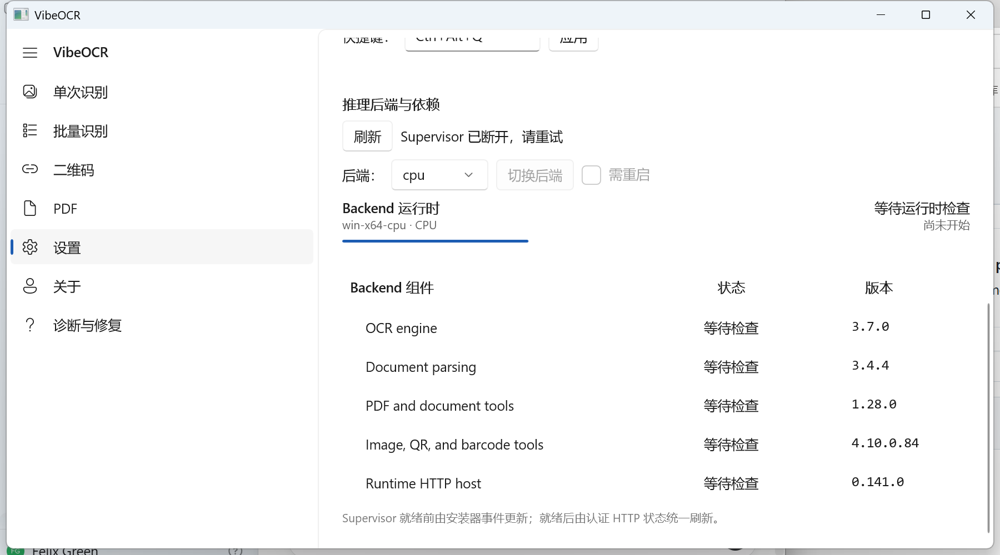
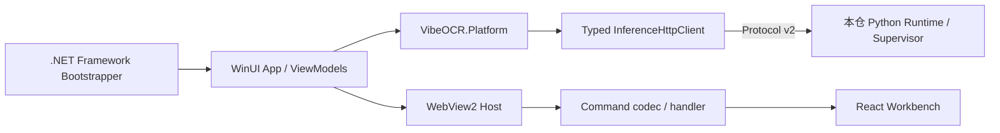

<div align="center">

# VibeOCR Next

**基于 .NET 10、WinUI 3 与 React 的现代 Windows OCR 桌面客户端**

[](https://github.com/FelixJI/vibeocr-next/actions/workflows/ci.yml)
[](https://github.com/FelixJI/vibeocr-next/releases/latest)
[](global.json)
[](src/dotnet/VibeOCR.App/WebAssets/package.json)
[](.ci/project.json)
[](LICENSE)

[下载](#下载与使用) · [架构](#架构) · [开发](#开发与验证) · [源码导读](docs/source-reading-guide.md) · [Workbench](docs/web-workbench-architecture.md)

</div>

VibeOCR Next 包含 WinUI 3 桌面客户端、Python Runtime 与跨进程内部契约。Platform 层管理窗口、
运行时与 typed HTTP client，WebView2 承载 React/TypeScript workbench。Supervisor、OCR/PDF
worker 仍在独立进程运行。



> [!IMPORTANT]
> Next 仅支持 Windows 10/11 x64，桌面技术栈是 WinUI 3，不是 WPF。Release 只发布由本仓当前
> 源码构建并绑定的单 Next 产品候选，不再消费独立 Backend/Protocol Release。

## 主要能力

- 原生 WinUI 3 桌面识别工作流；
- 本地 Backend 解析、安装、启动、ready 与 capability 协商；
- typed Protocol client 驱动的 job 提交、观察和控制；
- React/TypeScript WebAssets 与 WebView2 高级 workbench；
- 单实例、运行时前置检查和 Windows 打包交付。

## 下载与使用

1. 从 [Releases](https://github.com/FelixJI/vibeocr-next/releases/latest) 下载
   `VibeOCRNext-v<version>-win-x64.zip`。
2. （可选）校验完整性：同一次 Release 附带 `SHA256SUMS` 权威摘要。计算本地哈希并与其中
   对应文件条目的摘要比对（大小写不敏感）：

   ```powershell
   Get-FileHash .\VibeOCRNext-v*-win-x64.zip -Algorithm SHA256
   ```

3. 解压整个目录后运行根目录的 `VibeOCR.exe`；不要只复制 `current` 子目录。
4. 应用数据固定保存在解压根的 `state`；应用更新由 Velopack 在应用内检查、下载并应用。

### 运行环境与组件安装

- 应用随包提供快速 OCR 等基础能力，首次启动时会自动准备基础运行环境；高级组件按需安装。
- 在“设置 → 运行环境”中选择“推理设备”（CPU 或 CUDA GPU），并按需分别勾选
  “paddleocr”“mineru”或“CUDA GPU 运行时”等组件。这些选择只是安装意图：点击“预览安装
  范围”后，Backend 会给出安装计划，包括推理设备、各组件的保留/安装/替换/移除、预计下载量、
  新增磁盘占用和阻碍项；核对后点“确认此计划并安装”才会暂停识别服务并执行。
- 推理设备只是运行环境的安装目标：选择 CUDA GPU 不代表识别引擎已安装或可用，随包基础能力
  不受影响。
- PaddleOCR 与 MinerU 可在支持范围内独立选择，实际必需依赖与新增/保留/移除以安装计划为准。
  PaddleOCR 与基础环境、MinerU 使用相互隔离的解释器；兼容的依赖工件会复用已验证的
  下载缓存。缓存复用不等于安装目录共享，也不承诺所有场景的磁盘占用都会减少。
- 自部署 MinerU 4 服务可在“设置 → MinerU 连接”切换为远程模式，填写服务根地址及可选
  API Key 后保存；远程模式无需安装本地 MinerU、模型或 GPU。只有当前 Backend 声明
  `ocr.mineru-remote-api.v1` 时才能配置远程模式。保存不会验证连通性，可点“验证并准备远程服务”
  让 Backend 执行准备并刷新能力目录，再在单次或批量识别中选择 MinerU 文档模式。
  API Key 留空保存会保留已存值，勾选清除项后保存才会删除。远程模式不受本地模型预热、
  驻留 TTL 或释放控制，是否可解析以实际识别任务为准。
- 预计下载量只计本次新增下载，不等于最终环境大小；依赖尚未解析时显示“未知”，下载总量
  未知时只展示阶段与已用时，不定百分比。全部字节下载完成后还需经过安装、验证与激活，
  下载进度到 100% 不等于整体完成。

### 模型准备与就绪状态

- 依赖安装、模型首次准备、引擎在所选设备上实际可用和服务就绪是不同的阶段。模型由
  PaddleOCR/MinerU 的原生机制在首次使用时准备，可能需要额外下载；维护完成或“运行时已
  就绪”不代表模型全部就绪。
- 识别模式在对应任务中选择，各模式的可用性（可用/需准备依赖/不可用）以任务中的实际显示为准。

### 失败、取消与恢复

- 失败或取消会保留本次结果。按界面给出的原因与可用动作处理：“重新预览上次选择”重试、
  在“设置 → 下载来源”调整 Python 包下载源或模型下载源后再预览，或在“诊断与修复”导出
  脱敏诊断；修改来源或组件选择后需要重新预览并确认。
- 维护期间识别服务会暂停，结束后应用会自动恢复服务；服务恢复不代表本次安装已成功。
- 依赖包下载源用于安装运行环境，模型下载源由引擎准备模型时使用，两者用途不同。请不要
  手工执行 pip、删除运行环境目录或下载缓存，也不要为安装问题更改显卡驱动。

## 架构


```mermaid
flowchart LR
    WinUI["WinUI App / ViewModels"] --> Platform["VibeOCR.Platform"]
    Platform --> Client["Typed InferenceHttpClient"]
    Client -->|"Protocol v2"| Backend["本仓 Python Runtime / Supervisor"]
    WinUI --> WebView["WebView2 Host"]
    WebView --> Bridge["Command codec / handler"]
    Bridge --> React["React Workbench"]
    Bootstrapper[".NET Framework Bootstrapper"] --> WinUI
```

WinUI App 负责用户体验与进程生命周期，Platform 层隔离协议、系统和运行时能力；WebAssets 通过明确的
bridge command 与桌面交互，不直接访问 Runtime。Runtime 的 host 负责启动、鉴权和 HTTP 适配；
jobs 管理任务状态与调度；recognition 管理 OCR/MinerU 引擎和 worker；documents 管理 PDF 子进程、
表格与导出；codes 管理二维码；environments 管理安装、选择、设置与恢复；processes 托管共享的
Windows 子进程能力。跨进程 wire DTO、schema、golden 与生成物位于 `contracts/runtime`。

## 仓库地图

```text
src/dotnet/
├── VibeOCR.App/                    # WinUI 3 应用
│   └── WebAssets/                  # React 19 / TypeScript / Vite workbench
├── VibeOCR.Platform/               # Protocol、进程与平台 seam
├── VibeOCR.Contracts/              # 内部 C# wire 契约源码
├── VibeOCR.Runtime.Client/         # 内部 C# loopback HTTP client 源码
├── VibeOCR.ProductLayout.Shared/   # 产品布局共享源码（编译进 Platform）
└── ...Bootstrapper.../             # .NET Framework 4.7.2 启动器
src/runtime/vibeocr/runtime/       # Python Runtime，内部按功能分组
contracts/runtime/python/          # Python wire 契约、schema 与生成物
tests/dotnet/
├── VibeOCR.Platform.Tests/         # 平台与 Protocol 测试
├── VibeOCR.App.Tests/              # WinUI app tests
├── VibeOCR.Contracts.Tests/        # 内部 C# wire 契约测试
└── VibeOCR.Runtime.Client.Tests/   # 内部 C# HTTP client 测试
tests/runtime/ 与 tests/python/     # Runtime、产品布局与契约行为测试
config/runtime/                     # 第三方 CPython 归档锁与运行环境 profile 锁
scripts/
├── check_quality.py                # Python/Node 质量入口
├── generate_runtime_protocol.py    # 从内部 schema 生成 Python/C# wire 绑定
├── install_windows_app_runtime.ps1 # 开发/CI 前置条件
├── build-release.ps1               # 单产品候选构建入口
├── build_internal_runtime.ps1      # 从当前源码构建内部 Runtime 发布闭包
└── automation.py                   # CI/发布稳定入口
docs/                               # 架构、截图与源码阅读文档
.ci/project.json                    # 构建、测试、资产与发布契约
```

#87 起桌面构建直接消费本仓源码：C# 侧通过 ProjectReference 编译 `VibeOCR.Contracts` 与
`VibeOCR.Runtime.Client`，不再引用独立 Protocol SDK NuGet 包，默认也不解析、下载旧
`vibeocr-backend`/`vibeocr-protocol` Release。Python 侧构建为单个内部 wheel
`vibeocr-next-runtime`，版本由 `repository.json` 派生，作为运行环境隔离安装的实现细节随产品
分发，不再有独立 Python 契约发行面。内部只保留一个 wire v2 契约，随本仓同源演进；跨仓
SDK/Backend/Protocol minor 产品矩阵退役，但 capability 协商、进程隔离、已安装运行环境的
manifest 绑定与回滚语义保留。

Runtime 源自 `FelixJI/vibeocr-backend@7dc0ddf446152ef854901760d5125ad64860975b`；
wire/C# 契约源自 `FelixJI/vibeocr-protocol@31609e19bee1d44562eb74aff2d74fc75bb93eda`。
二者与本仓同为 MIT，作者版权见根 `LICENSE`；原仓保留历史。仅旧 Python UI 使用的
`frontend.py`、无 Runtime/Next 入口的 application facades、`model_bridge`/`ocr_sidecar`、
完整 Python runtime_client SDK、独立 SDK 发版/治理脚本未迁入。保留了直接消费的 C#
`RuntimeHttpClient`/`RuntimeClientException`、PDF IPC schema、wire parser 与安装计划行为测试；
仅旧 Python 客户端发行面的测试和只测试旧仓 CI/CD 配置的用例没有作为产品接口继续维护。

## 两条核心链路

### 应用启动

`App.xaml.cs::OnLaunched` 依次处理单实例、前置条件、窗口创建与 Supervisor 生命周期；
`InferenceSupervisorProcess` 读取 ready envelope 和 capabilities，再把可用 client 交给应用层。

### 提交识别

`RecognitionViewModel` 通过 deferred/typed client 调用 Platform 的 `InferenceHttpClient`，由后者按
Protocol v2 与 Backend 通信。ViewModel 不应拼 HTTP 或依赖模型内部类型。

完整路线见 [源码阅读指南](docs/source-reading-guide.md)。Web workbench 的 bridge 设计见
[`docs/web-workbench-architecture.md`](docs/web-workbench-architecture.md)。

## 开发与验证

需要 Windows、仓库锁定的 [.NET SDK](global.json)、[uv](https://docs.astral.sh/uv/) 与 WebAssets
声明的 Node/npm 版本：

```powershell
git clone https://github.com/FelixJI/vibeocr-next.git
cd vibeocr-next
uv sync --frozen
npm ci --prefix src/dotnet/VibeOCR.App/WebAssets
$env:RUNNER_TEMP = (New-Item -ItemType Directory -Force build/runner-temp).FullName
pwsh -File scripts/install_windows_app_runtime.ps1
dotnet tool restore
dotnet restore tests/dotnet/VibeOCR.Platform.Tests/VibeOCR.Platform.Tests.csproj --locked-mode
dotnet restore tests/dotnet/VibeOCR.App.Tests/VibeOCR.App.Tests.csproj --locked-mode
dotnet restore tests/dotnet/VibeOCR.Contracts.Tests/VibeOCR.Contracts.Tests.csproj --locked-mode
dotnet restore tests/dotnet/VibeOCR.Runtime.Client.Tests/VibeOCR.Runtime.Client.Tests.csproj --locked-mode
uv run --frozen python scripts/check_quality.py
dotnet test tests/dotnet/VibeOCR.Platform.Tests/VibeOCR.Platform.Tests.csproj -c Release --no-restore
pwsh -File scripts/test_app_ci.ps1
dotnet test tests/dotnet/VibeOCR.Contracts.Tests/VibeOCR.Contracts.Tests.csproj -c Release --no-restore
dotnet test tests/dotnet/VibeOCR.Runtime.Client.Tests/VibeOCR.Runtime.Client.Tests.csproj -c Release --no-restore
```

这些命令与 [`.ci/project.json`](.ci/project.json) 对齐。完整 PR CI 还会执行 release build、smoke、
产品 identity 与正式资产检查。

## WebAssets

WebAssets 使用 Node 24.x、npm 11.7、React 19、TypeScript 6 和 Vite 8。修改后至少运行其 package scripts
中的 lint、typecheck、test 与 build。WebView2 bridge 变更必须同步更新桌面 handler/codec、前端 client
与两侧测试。

## 发布资产

正式 Release 精确包含 Velopack full nupkg、相邻版本可选 delta nupkg、Portable
（`VibeOCRNext-v{version}-win-x64.zip`）、feed（`releases.win.json`）、`product-identity.json`
和 SPDX SBOM，不再单独发布独立组件锁文件。`scripts/build-release.ps1` 调用
`scripts/build_internal_runtime.ps1` 从当前源码产出内部 Runtime wheel、冻结 Runtime Installer、
固定第三方 offline base pack 与 runtime manifest；第三方 CPython 归档与各 Windows 运行环境
profile 锁保留在 `config/runtime/`。产品内部沿用 `runtime/backend/` 与
`app/metadata/component-lock.json`、`app/metadata/component-identities.json` 作为兼容稳定路径，
其内容绑定单一 Next 产品（component、repository、version、source SHA、runtime manifest
SHA-256 与所需 capability），不是旧仓产品图。版本与派生文件只由自动化脚本更新。

### 消费面迁移对照（#86 → #87）

- 独立 NuGet SDK：之前编译期从本地 feed 按 `Directory.Packages.props` 精确 pin
  `VibeOCR.Runtime.*`；现在 C# 直接 ProjectReference 本仓 `VibeOCR.Contracts`/
  `VibeOCR.Runtime.Client` 源码，NuGet 源只剩 nuget.org，不再存在独立 Protocol SDK 包。
- Python 契约发行：之前跨仓存在独立契约/SDK 发版面；现在只构建单个内部 wheel
  `vibeocr-next-runtime`（版本由 `repository.json` 派生），作为运行环境隔离安装的实现细节随
  产品分发，不对外独立发行。
- 跨仓 resolve/bind：之前 bootstrap 解析最新正式 Backend Release 及其绑定的 Protocol 并写
  组件 identity；现在默认不解析任何旧仓 Release，候选绑定由本仓 `product-identity.json` 与
  产品内 runtime manifest/component lock 完成。
- Protocol 发行字段：之前候选 identity 含 `protocol`/`protocol_sdk` 版本与 release manifest
  摘要；现在 identity 只绑定单一 Next 产品的 component/repository/version/source_sha。
- 外部 hash 边界：第三方 CPython 归档、offline pack 等外部下载字节仍保留 SHA-256 校验与
  manifest 绑定；本仓生成物交给 Git/构建/发布流水线约束，不叠加手工 hash。

## 参与贡献

请先阅读 [`CONTRIBUTING.md`](CONTRIBUTING.md)、[源码阅读指南](docs/source-reading-guide.md) 和
[Workbench 架构](docs/web-workbench-architecture.md)。UI 可见改动需要在 PR 附截图；提交使用 Conventional Commit。

## 许可证

本项目基于 [LICENSE](LICENSE) 中的条款发布。
