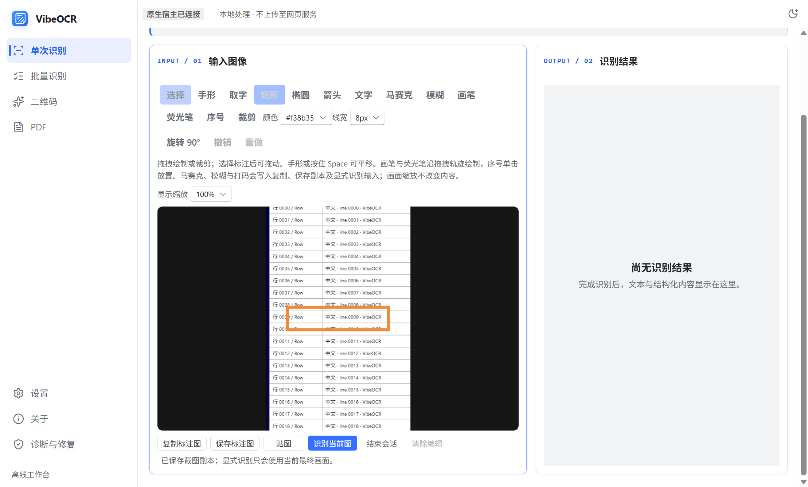
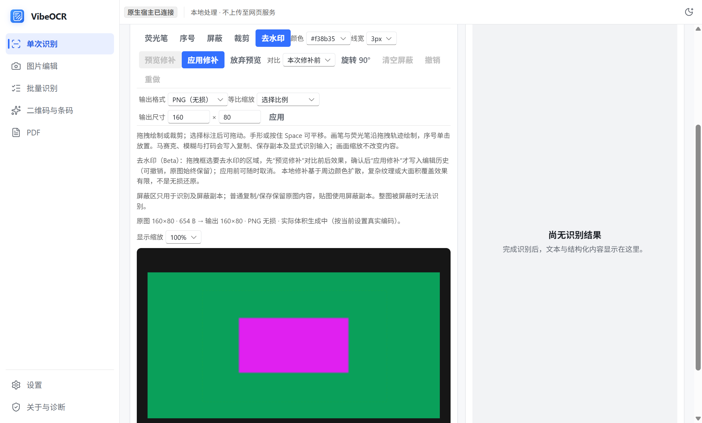
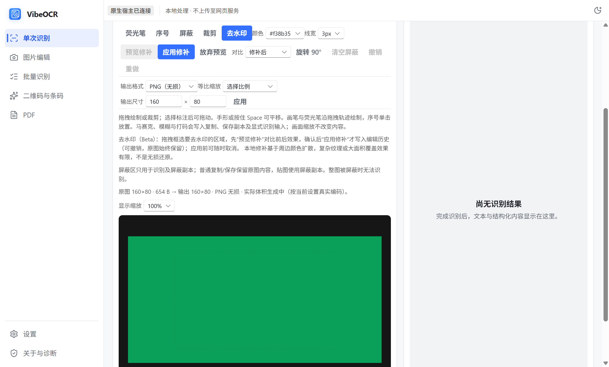

# 截图与原生快捷动作

设置页可配置截图编辑、截图识别、剪贴板识别、悬浮栏显示/隐藏和打开工作台五种动作。截图识别默认使用 `Ctrl+Alt+Q`；其他动作默认不占用全局快捷键。注册冲突或配置保存失败时保留原生效绑定，并显示失败原因。

悬浮工具栏支持启用、主动隐藏、靠边位置和鼠标离开后自动收起。主动隐藏不会被鼠标经过唤回，可从设置、托盘或已绑定的快捷键恢复。截图期间主窗口、工具栏和感应条自动让位，结束或取消后恢复原状态；重复截图动作不会创建第二个选区窗。

## 框选与确认

- 悬停外部窗口提供窗口候选，`Tab` 切换可用窗口、控件与父级候选。UIA 超时或不可用时仍可手动框选。
- 拖动创建选区，松开左键后进入待确认状态；在选区内拖动可移动，在边缘或控制点处拖动可调整大小。
- `Enter` 确认原始冻结快照中的选区。截图编辑进入统一图片会话，截图识别按当前识别设置提交。
- 右键在拖动中恢复拖动前的状态，待确认时清空选区，空选区时退出；`Esc` 始终退出截图。
- 撤销和重做只影响选区操作，不撤销已提交的识别任务。

| 按键 | 操作 |
| --- | --- |
| Enter | 确认选区 |
| Tab | 切换智能候选 |
| Esc | 退出截图 |
| 方向键 | 移动选区 1 个物理像素 |
| Shift + 方向键 | 移动选区 10 个物理像素 |
| Ctrl + 方向键 | 调整选区右边缘／下边缘 1 个物理像素 |
| Ctrl + Shift + 方向键 | 调整选区右边缘／下边缘 10 个物理像素 |
| Ctrl + Z | 撤销 |
| Ctrl + Y / Ctrl + Shift + Z | 重做 |
| M | 显示／隐藏放大镜 |
| Ctrl + C | 复制当前取样像素的 HEX 色号 |

放大镜展示鼠标周围 11 × 11 个原始像素，中心红框对应色号；同时显示桌面坐标、HEX 和 RGB。取色来自冻结快照，不受遮罩及选框颜色影响。

## 纵向长截图

在识别工作台选择“长截图”，框选同一个窗口内实际滚动的内容区域，避开固定标题、悬浮按钮和滚动条。确认选区后点击“开始”，缓慢向下滚动，每次停稳后等待计数更新，再继续；点击“完成”将整张图送入同一编辑器，可标注、复制、保存、选字或主动识别。

首期只支持静态内容的纵向向下滚动。每次需保留至少四分之一画面（且不少于 32 像素）的重叠；纯色、重复图案、动画或跳跃过大的内容无法可靠匹配时会停止。反向滚动、移动/缩放来源窗口、窗口被遮挡或切换到其他应用也会停止。控制窗口须完全处于选区外，没有空间时请缩小选区。操作控制窗口时暂停采样；点击完成后回到源窗口，等待最后一帧稳定再生成长图。

成品最多 800 万像素、单边 32768 像素及 200 个有效画面，未滚动的重复画面不计数。取消、失败或超限会丢弃本次拼接，不将不完整图片冒充成品；重新框选后可再试。捕获本身不提交 OCR，也不安装模型。普通截图与长截图均不更改 Windows 任务栏的自动隐藏偏好。
## 编辑与输出

截图编辑支持裁剪、旋转、标注、马赛克和模糊；独立图片编辑与截图会话共用同一套工具。去水印（Beta）：拖拽框选区域后先预览修补效果，明确“应用”才写入可撤销的编辑历史；复杂纹理或大面积覆盖效果有限，不是无损还原，完全在本地执行，不依赖 OCR 环境、GPU 或网络。复制图片、保存副本和显式识别均使用当前最终画面；纯截图编辑不触发 OCR 或安装运行环境。

合成样例的修补前后如下；预览成功后仍需点击“应用修补”，才会改变后续复制、保存及识别输入。

“屏蔽”工具拖拽框选识别排除区，可多选、拖动、八点缩放、删除、清空并撤销/重做，单图最多 64 个（与贴图排除矩形上报上限一致）。排除区只从识别输入与显式屏蔽副本中移除内容：提交识别前会在屏蔽区写入不透明白色像素（原图文字不进入引擎），普通复制/保存仍保留原图内容；也可用“复制/保存屏蔽副本”显式导出真实白色覆盖的成品。桌面贴图是可取字的识别面，同样使用与识别相同的屏蔽像素，其可选行与编辑器一致地丢弃与屏蔽区相交的行。原图始终保留，屏蔽不是永久脱敏。整图都被屏蔽（含贴图）时会拒绝识别并提示。坐标随裁剪、旋转与输出尺寸变换，视图缩放不影响数据；掩膜矩形在像素网格上确定性外扩取整（每边至多 1px），保证屏蔽区边缘不残留原始文字像素；屏蔽区变更会推进内容修订，旧识别结果与文字层立即失效。

以上截图由真实 WinUI/WebView2 验收生成，图像内容为合成控件。

## 图片选字与桌面贴图

截图取字在当前图片上异步准备文字层；也可从编辑器进入选字模式。使用已就绪的本地轻量引擎，没有本地能力时提示准备，不自动安装或切换到远程识别。手形用于平移，选字模式用于拖选，标注工具用于修改图片。

可拖选中文、英文行内子串及跨行文本，通过 Ctrl+C 或菜单复制所选内容。当前快速引擎提供行框，文字层利用浏览器字形排版贴合行框，字符对齐是近似值，不是逐字符识别坐标。编辑、裁剪、旋转或打码使当前旧文字层立即失效；重新取字使用修改后的最终像素。

桌面贴图可置顶、移动、缩放、调节透明度、复制、保存与关闭，最多同时四张。显示缩放不重新识别；不同贴图各自保留冻结图片，关闭其中一个不会回收另一个的图片。原截图换图后，旧贴图明确标为旧快照，可主动按其原图取字，不会覆盖新截图结果。纯截图编辑与纯贴图不触发 OCR 或环境安装。

