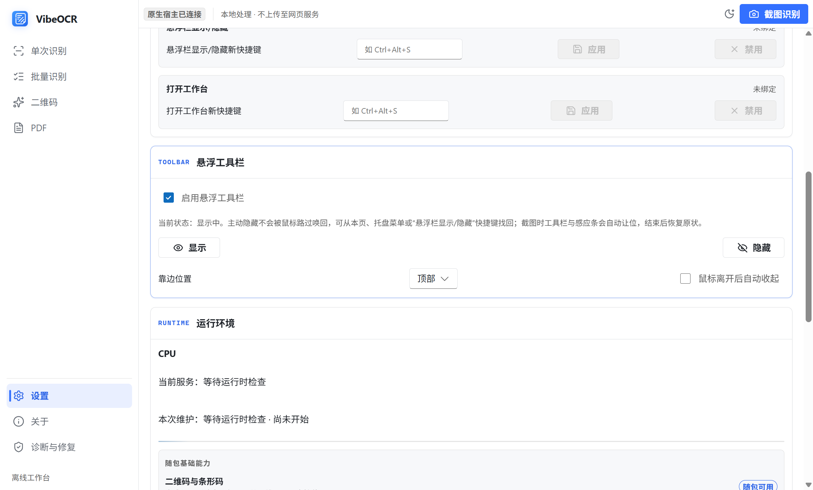
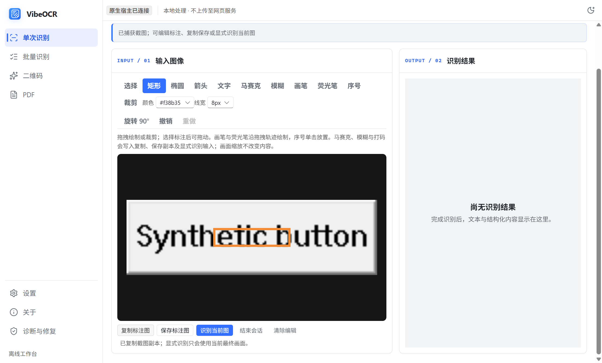
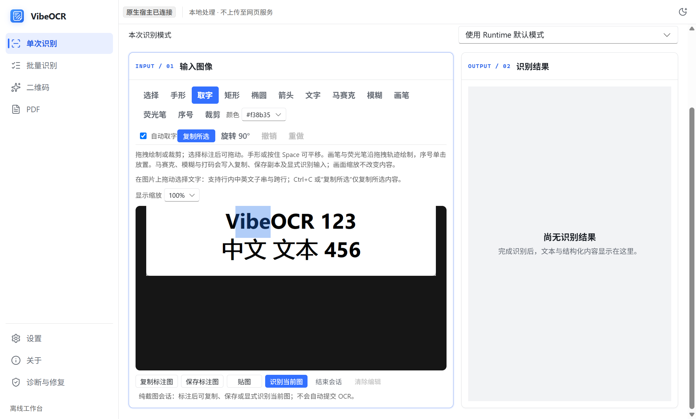

# 截图与原生快捷动作

设置页可配置截图编辑、截图识别、剪贴板识别、悬浮栏显示/隐藏和打开工作台五种动作。截图识别默认使用 `Ctrl+Alt+Q`；其他动作默认不占用全局快捷键。注册冲突或配置保存失败时保留原生效绑定，并显示失败原因。

悬浮工具栏支持启用、主动隐藏、靠边位置和鼠标离开后自动收起。主动隐藏不会被鼠标经过唤回，可从设置、托盘或已绑定的快捷键恢复。截图期间主窗口、工具栏和感应条自动让位，结束或取消后恢复原状态；重复截图动作不会创建第二个选区窗。

## 框选与确认

- 悬停外部窗口提供窗口候选，`Tab` 切换可用窗口、控件与父级候选。UIA 超时或不可用时仍可手动框选。
- 拖动创建选区，松开左键后进入待确认状态；在选区内拖动可移动，在边缘或控制点处拖动可调整大小。
- `Enter` 确认原始冻结快照中的选区。截图编辑进入统一图片会话，截图识别按当前识别设置提交。
- 右键在拖动中恢复拖动前的状态，待确认时清空选区，空选区时退出；`Esc` 始终退出截图。
- 撤销和重做只影响选区操作，不撤销已提交的识别任务。

| 按键 | 操作 |
| --- | --- |
| Enter | 确认选区 |
| Tab | 切换智能候选 |
| Esc | 退出截图 |
| 方向键 | 移动选区 1 个物理像素 |
| Shift + 方向键 | 移动选区 10 个物理像素 |
| Ctrl + 方向键 | 调整选区右边缘／下边缘 1 个物理像素 |
| Ctrl + Shift + 方向键 | 调整选区右边缘／下边缘 10 个物理像素 |
| Ctrl + Z | 撤销 |
| Ctrl + Y / Ctrl + Shift + Z | 重做 |
| M | 显示／隐藏放大镜 |
| Ctrl + C | 复制当前取样像素的 HEX 色号 |

放大镜展示鼠标周围 11 × 11 个原始像素，中心红框对应色号；同时显示桌面坐标、HEX 和 RGB。取色来自冻结快照，不受遮罩及选框颜色影响。

## 编辑与输出

截图编辑支持裁剪、旋转、标注、马赛克和模糊。复制图片、保存副本和显式识别均使用当前最终画面；纯截图编辑不触发 OCR 或安装运行环境。

以上截图由真实 WinUI/WebView2 验收生成，图像内容为合成控件。

## 图片选字与桌面贴图

截图取字在当前图片上异步准备文字层；也可从编辑器进入选字模式。使用已就绪的本地轻量引擎，没有本地能力时提示准备，不自动安装或切换到远程识别。手形用于平移，选字模式用于拖选，标注工具用于修改图片。

可拖选中文、英文行内子串及跨行文本，通过 Ctrl+C 或菜单复制所选内容。当前快速引擎提供行框，文字层利用浏览器字形排版贴合行框，字符对齐是近似值，不是逐字符识别坐标。编辑、裁剪、旋转或打码使当前旧文字层立即失效；重新取字使用修改后的最终像素。

桌面贴图可置顶、移动、缩放、调节透明度、复制、保存与关闭，最多同时四张。显示缩放不重新识别；不同贴图各自保留冻结图片，关闭其中一个不会回收另一个的图片。原截图换图后，旧贴图明确标为旧快照，可主动按其原图取字，不会覆盖新截图结果。纯截图编辑与纯贴图不触发 OCR 或环境安装。

