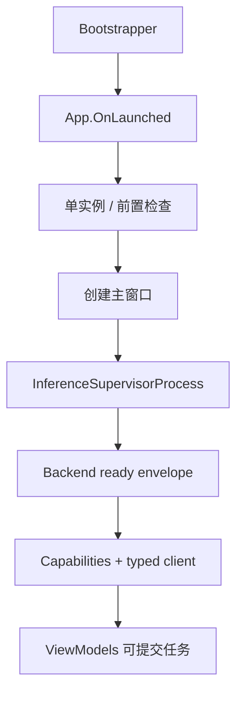
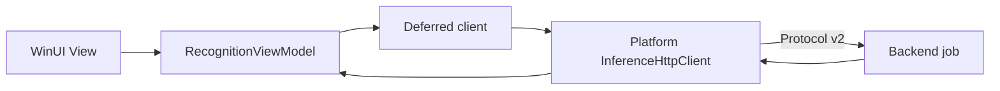

# VibeOCR Next 源码阅读指南

本指南面向初次接触 WinUI、.NET Platform 与 WebView2 混合架构的贡献者。不要试图同时读完 C#、React
和 Backend；先沿一条桌面请求链建立稳定边界，再按兴趣深入。

## 五块心智地图

1. **Bootstrapper**：在旧 .NET Framework 环境下处理启动前置条件。
2. **WinUI App**：窗口、ViewModel、用户工作流与应用生命周期。
3. **VibeOCR.Platform**：Supervisor 进程、typed client 与平台 seam。
4. **WebAssets**：React 高级 workbench。
5. **Backend/Protocol**：独立发布的本地推理组件与跨进程契约。

## 20 分钟启动链

1. 读 `global.json`，确认 SDK 锁定策略。
2. 找到 Bootstrapper 的 `.csproj` 与入口，理解它与 WinUI App 的职责分界。
3. 读 `src/dotnet/VibeOCR.App/App.xaml.cs` 的 `OnLaunched`。
4. 搜索 `InferenceSupervisorProcess`，查看进程启动、ready envelope 与 shutdown。
5. 搜索 capability 的消费位置，确认功能如何协商。
6. 对照 `VibeOCR.Platform.Tests` 与 `VibeOCR.App.Tests` 的启动/失败测试。



启动成功不等于模型已经加载；ready 只表示 Supervisor 协议边界可用。

## 第一条纵向链：提交识别

从 `RecognitionViewModel` 选择一个 command：

1. 看 ViewModel 如何读取/验证 UI 状态。
2. 找到 deferred client：启动完成前后，调用怎样获得真实 client？
3. 进入 Platform 的 `InferenceHttpClient`，查看 typed request、auth、timeout 与 Protocol route。
4. 追踪 Backend job id、observe 和结果如何返回。
5. 查看取消、错误与窗口关闭如何更新 ViewModel 状态。
6. 在 Platform/App tests 中搜索同名方法、状态或错误消息。



重点确认 ViewModel 只依赖稳定接口，而不负责 HTTP、进程或模型细节。

## 第二条纵向链：Web workbench command

先阅读 `docs/web-workbench-architecture.md`，再选择一个现有 command：

1. 从 React bridge client 找到 command name 与 payload type。
2. 追踪 WebView2 host 的消息接收与 codec 校验。
3. 找到 Desktop command handler 如何调用 App/Platform 能力。
4. 沿 response/error 回到前端 Promise 与 UI state。
5. 对照 TypeScript 和 C# 两侧测试，确认字段、错误和取消一致。

WebAssets 不直接连接 Backend；bridge 是浏览器内容与桌面权限之间的边界。

## 各方向阅读入口

### WinUI 与 ViewModel

从 App.xaml.cs、主窗口和目标 ViewModel 进入。关注 dispatcher/thread affinity、async command、窗口关闭
和可观察状态。UI 可见改动需截图与 App tests。

### Platform 与 Protocol

从 `InferenceSupervisorProcess`、`InferenceHttpClient` 和相邻 Platform tests 进入。关注 ready parsing、
capabilities、auth、timeout、取消与进程回收。

### React/TypeScript

先读 `WebAssets/package.json` 的 scripts，再读入口、bridge client 和目标 feature。修改后运行 lint、
typecheck、test、build；不要用 `any` 或跳过 codec 掩盖跨边界类型问题。

### WebView2 bridge

把 command catalog、payload codec、desktop handler 与前端 client 当成一个协议面。新增命令时同步更新
两侧类型和测试，不在字符串消息里偷偷增加未验证字段。

### 组件与发布

从 `.ci/project.json`、component policy/resolve scripts、`scripts/automation.py` 阅读。Backend 与 Protocol
通过正式 Release、component lock 和 identity 绑定，不通过邻仓源码路径耦合。

## 分层验证

### WebAssets 改动

```powershell
npm ci --prefix src/dotnet/VibeOCR.App/WebAssets
npm run lint --prefix src/dotnet/VibeOCR.App/WebAssets
npm run typecheck --prefix src/dotnet/VibeOCR.App/WebAssets
npm run test --prefix src/dotnet/VibeOCR.App/WebAssets
npm run build --prefix src/dotnet/VibeOCR.App/WebAssets
```

### Platform 改动

```powershell
dotnet restore tests/dotnet/VibeOCR.Platform.Tests/VibeOCR.Platform.Tests.csproj --locked-mode
dotnet test tests/dotnet/VibeOCR.Platform.Tests/VibeOCR.Platform.Tests.csproj -c Release --no-restore
```

### App/混合边界改动

```powershell
pwsh -File scripts/install_windows_app_runtime.ps1
dotnet restore tests/dotnet/VibeOCR.App.Tests/VibeOCR.App.Tests.csproj --locked-mode
pwsh -File scripts/test_app_ci.ps1
```

提交前在 README 建立的 venv 中运行 `uv run --no-sync python scripts/check_quality.py`；完整 release
build/smoke 由 PR CI 权威执行。

## 常见误区

- **把 Next 说成 WPF**：本项目桌面框架是 WinUI 3。
- **让 ViewModel 直接拼 HTTP**：Protocol 与进程细节属于 Platform client。
- **让 WebAssets 直连 Backend**：浏览器内容必须通过 WebView2 bridge。
- **把 ready 当模型已加载**：模型可按 job 延迟加载。
- **只改 C# 或 TypeScript 一侧的 bridge**：跨边界 command 必须同步更新。
- **用版本号替代 capability**：运行时功能按 capabilities 协商。
- **所有改动都跑完整打包**：先用相邻测试，只有资源、组件或打包边界变化才扩大验证。

## 读完后的自检

你应该能回答：

- `OnLaunched` 如何连接窗口与 Supervisor 生命周期？
- `RecognitionViewModel` 如何取得 typed client 并观察 job？
- ready、capability 与模型加载分别表示什么？
- 一个 Web command 怎样跨越 React、WebView2 codec 和 Desktop handler？
- 哪些改动需要 Platform tests、App tests 或完整 release smoke？

回答这些问题后，从一个 ViewModel 状态、Platform client 行为或现有 bridge command 的小改动开始最合适。
