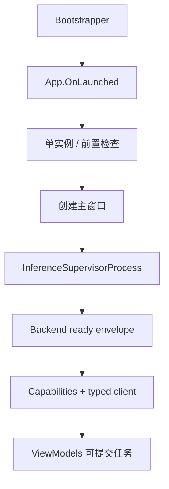
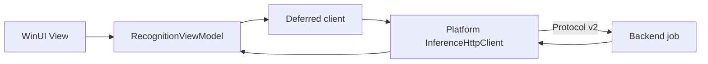

# VibeOCR Next 源码阅读指南

本指南面向初次接触 WinUI、.NET Platform 与 WebView2 混合架构的贡献者。不要试图同时读完 C#、React
和 Backend；先沿一条桌面请求链建立稳定边界，再按兴趣深入。

## 五块心智地图

1. **Bootstrapper**：在旧 .NET Framework 环境下处理启动前置条件。
2. **WinUI App**：窗口、ViewModel、用户工作流与应用生命周期。
3. **VibeOCR.Platform**：Supervisor 进程、typed client 与平台 seam。
4. **WebAssets**：React 高级 workbench。
5. **Python Runtime 与内部契约**：本仓源码内的本地推理服务（Supervisor、OCR/PDF/MinerU
   worker）与唯一 wire v2 跨进程契约，随单产品同源构建。

## 功能职责与权威状态映射

单仓多语言不等于任意语言可做任意事。下表把主要功能映射到权威状态/实现语言、调用边界和保留理由，路径均可在当前仓库定位：

| 功能 | 权威状态 / 实现语言 | 调用边界 | 保留理由 |
|---|---|---|---|
| 宿主：窗口、单实例与跨产品互斥、热键、剪贴板/文件授权 | C#/WinUI（`VibeOCR.App`、`VibeOCR.Platform`） | WinUI/Win32 原生；剪贴板/文件命令经 `App/Workbench` 暴露给 Web | 系统级集成与权限仲裁只能在原生层 |
| 桌面工作流、应用权威状态与更新 | C#（`src/dotnet/VibeOCR.App/Features`、ViewModels） | ViewModel → Platform typed client；更新走 Velopack feed | 权威状态单点，UI 不复制协议/进程细节 |
| Workbench 展示与局部编辑 | React/TypeScript（`WebAssets/src` 的 `features`/`components`） | WebView2 消息桥：`WebAssets/src/bridge` ↔ `App/Web` codec ↔ `App/Workbench` handler | 富交互迭代快；浏览器内容无直接系统/Runtime 权限 |
| 二维码生成与 PNG/JPEG 保存 | C#（`VibeOCR.App/Features/QrCode`） | WebView 命令 → 本地 ZXing.Net 与 Windows 图片编码；不等待 Supervisor | 无需识别运行环境即可生成，文件授权留在宿主 |
| OCR/MinerU 推理、PDF/表格/导出、二维码解码 | Python/CPython（`runtime/recognition`、`documents`、`codes`） | Desktop↔Runtime 唯一 v2 内部 HTTP wire（`contracts/runtime` + `VibeOCR.Runtime.Client`） | 直接消费 OCR/PDF 生态；worker 隔离与引擎生命周期同源 |
| 任务调度与共享子进程 | Python（`runtime/jobs`、`processes`） | 入口是 host 暴露的 v2 内部 HTTP 路由；Paddle/MinerU/PDF worker 是 Runtime 内部管理的子进程，不经桌面直接调用 | 跨 job 状态与进程复用集中在 Runtime |
| 运行环境安装事务（组件选择、安装计划、设备就绪、回滚） | Python/CPython（`runtime/environments`，经产品内冻结 Installer 可执行文件交付） | C# 侧由 `Platform/Bootstrap/RuntimeInstallerClient` 以子进程调用冻结 Installer：inspect/ensure/repair/install_plan 与 cancel/retry/observe 都是独立子进程命令（`--request-json` 参数），进度走 stdout NDJSON 事件流（`ndjson.v1/v2`），结果为单个 JSON envelope；安装计划/设备就绪真值只在 Runtime，C#/TS 不复制包依赖推导 | 依赖解析与 manifest 绑定在事务内保持一致 |
| Windows 构建/打包/安装前置 | PowerShell（`scripts/build-release.ps1`、`build_internal_runtime.ps1`、`install_windows_app_runtime.ps1`） | 本地/CI 命令行 | Windows SDK、Velopack 与 App Runtime 适配 |
| 通用生成/验证/自动化 | Python（`scripts/check_quality.py`、`generate_runtime_protocol.py`、`automation.py`） | 本地/CI 命令行 | 锁定工具链与稳定 CLI，不为语言统一翻译脚本 |

两个跨边界协议不要混淆：WebView 消息桥（React ↔ `App/Web`/`App/Workbench`）与 Desktop↔Runtime 内部 HTTP
wire 都有 v2 命名，但编号相同不代表同一协议；前者是浏览器内容与桌面权限的边界，后者是进程间契约
（`contracts/runtime` 的 schema、golden 与生成物）。安装事务又是另一条边界：桌面通过 Runtime Installer
子进程命令（NDJSON 事件流 + 最终 envelope）驱动，既不是 WebView 桥也不是 loopback HTTP。修改任一侧
必须同步对应两侧类型与测试。

二维码公开入口只暴露文本 QR：300×300、UTF-8、纠错 M、四模块静区和 PNG 预览，保存支持真实 PNG/JPEG。
#97 的 C# 本地生成在 Runtime 未启动、启动失败、断开或维护时仍可使用；图片解码继续通过 Runtime。
Python 旧生成路由与选项仍有内部契约消费者，本次保留，不据此宣称移除了 Pillow 等依赖。
#98 已移除无生产消费者的旧 JS 核心、薄 TS 包装及专属遗留测试；生产编辑器使用
`components/ImageCanvasEditor.tsx`、`annotationGeometry.ts` 与 `annotationHandoff.ts`，bridge 使用
`bridge/client.ts` 和 `bridge/runtime.ts`，并由编译期类型契约与运行时消息测试共同校验。
二者均不引入 Python.NET/IronPython、第二套 IPC 或全量原生 UI 重写，不移除 Python OCR/PDF 能力、
已证明的 worker 隔离、Runtime 安装事务与内部 wire。

## 20 分钟启动链

1. 读 `global.json`，确认 SDK 锁定策略。
2. 找到 Bootstrapper 的 `.csproj` 与入口，理解它与 WinUI App 的职责分界。
3. 读 `src/dotnet/VibeOCR.App/App.xaml.cs` 的 `OnLaunched`。
4. 搜索 `InferenceSupervisorProcess`，查看进程启动、ready envelope 与 shutdown。
5. 搜索 capability 的消费位置，确认功能如何协商。
6. 对照 `VibeOCR.Platform.Tests` 与 `VibeOCR.App.Tests` 的启动/失败测试。


```mermaid
flowchart TD
    A["Bootstrapper"] --> B["App.OnLaunched"]
    B --> C["单实例 / 前置检查"]
    C --> D["创建主窗口"]
    D --> E["InferenceSupervisorProcess"]
    E --> F["Backend ready envelope"]
    F --> G["Capabilities + typed client"]
    G --> H["ViewModels 可提交任务"]
```

启动成功不等于模型已经加载；ready 只表示 Supervisor 协议边界可用。

## 第一条纵向链：提交识别

从 `RecognitionViewModel` 选择一个 command：

1. 看 ViewModel 如何读取/验证 UI 状态。
2. 找到 deferred client：启动完成前后，调用怎样获得真实 client？
3. 进入 Platform 的 `InferenceHttpClient`，查看 typed request、auth、timeout 与 Protocol route。
4. 追踪 Backend job id、observe 和结果如何返回。
5. 查看取消、错误与窗口关闭如何更新 ViewModel 状态。
6. 在 Platform/App tests 中搜索同名方法、状态或错误消息。


```mermaid
flowchart LR
    UI["WinUI View"] --> VM["RecognitionViewModel"]
    VM --> Deferred["Deferred client"]
    Deferred --> Client["Platform InferenceHttpClient"]
    Client -->|"Protocol v2"| Backend["Backend job"]
    Backend --> Client
    Client --> VM
```

重点确认 ViewModel 只依赖稳定接口，而不负责 HTTP、进程或模型细节。

## 第二条纵向链：Web workbench command

先阅读 `docs/web-workbench-architecture.md`，再选择一个现有 command：

1. 从 React bridge client 找到 command name 与 payload type。
2. 追踪 WebView2 host 的消息接收与 codec 校验。
3. 找到 Desktop command handler 如何调用 App/Platform 能力。
4. 沿 response/error 回到前端 Promise 与 UI state。
5. 对照 TypeScript 和 C# 两侧测试，确认字段、错误和取消一致。

WebAssets 不直接连接 Backend；bridge 是浏览器内容与桌面权限之间的边界。

## 各方向阅读入口

### WinUI 与 ViewModel

从 App.xaml.cs、主窗口和目标 ViewModel 进入。关注 dispatcher/thread affinity、async command、窗口关闭
和可观察状态。UI 可见改动需截图与 App tests。

### Platform 与 Protocol

从 `InferenceSupervisorProcess`、`InferenceHttpClient` 和相邻 Platform tests 进入。关注 ready parsing、
capabilities、auth、timeout、取消与进程回收。

### React/TypeScript

先读 `WebAssets/package.json` 的 scripts，再读入口、bridge client 和目标 feature。修改后运行 lint、
typecheck、test、build；不要用 `any` 或跳过 codec 掩盖跨边界类型问题。

### WebView2 bridge

把 command catalog、payload codec、desktop handler 与前端 client 当成一个协议面。新增命令时同步更新
两侧类型和测试，不在字符串消息里偷偷增加未验证字段。

### 组件与发布

从 `.ci/project.json`、`scripts/build-release.ps1`、`scripts/build_internal_runtime.ps1` 与
`scripts/automation.py` 阅读。单产品候选全部由本仓当前源码构建：C# 以 ProjectReference 编译，
内部 Runtime 从当前源码产出 wheel、冻结 installer、offline base pack 与 runtime manifest。
Release 外部 `product-identity.json` 以 `project:{component,repository,version,source_sha}`
绑定候选；`runtime-manifest.json` 的 `product` 同为这四字段，installer 摘要、profile 与
capabilities 在 manifest 顶层；`app/metadata/component-lock.json` 的 `product` 追加
`runtime_manifest_sha256` 与 `accelerator`，`required_capabilities` 在 lock 顶层。默认不解析
旧仓 Backend/Protocol Release。

## 分层验证

### WebAssets 改动

```powershell
npm ci --prefix src/dotnet/VibeOCR.App/WebAssets
npm run lint --prefix src/dotnet/VibeOCR.App/WebAssets
npm run typecheck --prefix src/dotnet/VibeOCR.App/WebAssets
npm run test --prefix src/dotnet/VibeOCR.App/WebAssets
npm run build --prefix src/dotnet/VibeOCR.App/WebAssets
```

### Platform 改动

```powershell
dotnet restore tests/dotnet/VibeOCR.Platform.Tests/VibeOCR.Platform.Tests.csproj --locked-mode
dotnet test tests/dotnet/VibeOCR.Platform.Tests/VibeOCR.Platform.Tests.csproj -c Release --no-restore
```

### App/混合边界改动

```powershell
pwsh -File scripts/install_windows_app_runtime.ps1
dotnet restore tests/dotnet/VibeOCR.App.Tests/VibeOCR.App.Tests.csproj --locked-mode
pwsh -File scripts/test_app_ci.ps1
```

提交前运行 `uv run --frozen python scripts/check_quality.py`；完整 release
build/smoke 由 PR CI 权威执行。

## 常见误区

- **把 Next 说成 WPF**：本项目桌面框架是 WinUI 3。
- **让 ViewModel 直接拼 HTTP**：Protocol 与进程细节属于 Platform client。
- **让 WebAssets 直连 Backend**：浏览器内容必须通过 WebView2 bridge。
- **把 ready 当模型已加载**：模型可按 job 延迟加载。
- **只改 C# 或 TypeScript 一侧的 bridge**：跨边界 command 必须同步更新。
- **用版本号替代 capability**：运行时功能按 capabilities 协商。
- **所有改动都跑完整打包**：先用相邻测试，只有资源、组件或打包边界变化才扩大验证。

## 读完后的自检

你应该能回答：

- `OnLaunched` 如何连接窗口与 Supervisor 生命周期？
- `RecognitionViewModel` 如何取得 typed client 并观察 job？
- ready、capability 与模型加载分别表示什么？
- 一个 Web command 怎样跨越 React、WebView2 codec 和 Desktop handler？
- 哪些改动需要 Platform tests、App tests 或完整 release smoke？

回答这些问题后，从一个 ViewModel 状态、Platform client 行为或现有 bridge command 的小改动开始最合适。
