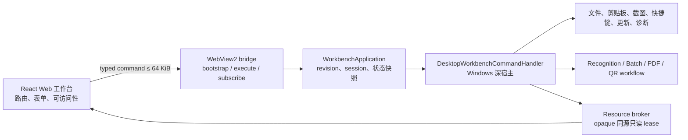

# Web 工作台 + 原生深宿主

## 目标

VibeOCR Next 的可见主界面由 React/TypeScript/Fluent UI 统一呈现；Windows 平台能力、任务生命周期、Backend 治理、文件与剪贴板访问、更新和诊断仍由 C# 原生宿主管理。Web 不直接访问 Backend、本地文件路径或外网。

## 模块边界

`WorkbenchApplication` 是稳定 interface。Web 只发送白名单命令并订阅语义状态；C# 拥有 route、任务、持久设置、资源租约与恢复状态。焦点、hover、菜单、未提交表单草稿等纯展示状态归 Web。

## 协议不变量

- bridge protocol 与 Backend Protocol 独立版本化。
- 每条消息按 UTF-8 计算不超过 64 KiB。
- 命令是封闭 discriminated union；未知字段、未知 action、错误类型和超限消息 fail closed。
- `revision` 全局单调；旧 session 或旧 revision 的事件被 Web 忽略。
- 图片、二维码、PDF 预览和长文本通过 `https://app.vibeocr/__resource/{opaque-token}` 获取，不进入 JSON，也不暴露本地路径。
- 副作用命令在 WebView 恢复后不自动重放。

## WebView2 与恢复

产品仅创建一个长期存活的 WebView2。静态资产映射到 `https://app.vibeocr/`，顶层导航限制在产品入口与 hash route；外部导航被拒绝。renderer/browser 故障每个 episode 最多自动恢复一次，连续失败显示原生恢复页，提供重载、导出脱敏诊断和退出。

## 构建与发布

质量入口依次执行 Web format、lint、typecheck、tests、production build 和离线闭包验证。App 只打包 `WebAssets/dist`；验证器拒绝外链、目录逃逸、source map、TS/TSX、`node_modules`、`unsafe-inline` 和 `unsafe-eval`。真实 smoke 必须启动 publish/package 中的应用并等待 bridge-ready health signal。

## 当前迁移状态

可见 shell、七路由、深宿主、bridge、资源 broker、恢复页和发布闭包已完成切换。Canvas 的选择/形状/文字/隐私标记/裁剪/旋转/撤销重做、批量队列/重排/并发/分页、PDF 缩略图/多选/分页、二维码 busy/cancel 与受限 URL 打开均已接入；旧 XAML 页面、PreviewHost 和 WebMessageRouter 已删除。

每次 renderer bootstrap 都获得新 session；revision 保持单调，旧页面排队消息由 session 隔离。批量、PDF 与 QR 的 bridge 状态使用有界窗口并保留总数，最坏 Unicode 序列化仍小于 64 KiB。完整候选构建使用正式 Backend/Protocol 绑定，打包前 bridge-ready smoke 在隔离副本与独立 WebView2 user-data 上运行，防止运行时 profile 污染候选目录。
